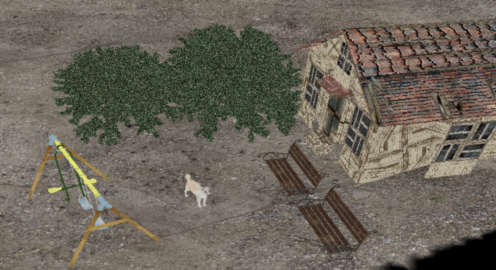

# 3d-model-rendering-with-OpenGL
Plotting a Model by Reading 3D Point Cloud, Normal, Polygon, and Texture Information Using OpenGL

## Constructing the Ground

To construct the ground using a ground image, I implemented a parser to read material properties such as Ns, Ka, Kd, Ks, Ke, Ni, and d from the ground’s .mtl file. The scene center and camera perspective were adjusted accordingly, and the stb_image library was used to load and apply texture images.

## Loading 3D Objects

To make transformations such as rotation and translation easier when loading 3D objects, coordinate axes were displayed for reference. The camera was positioned at (0, 2, 2) and set to look toward (0, 0, 0).

A bench .obj model was first loaded with (0, 0, 0) as the reference point. The object information was then examined using Blender, a 3D modeling software, to perform texturing. The scene was composed by translating objects along the X-axis and applying appropriate rotations around the Y and Z axes.

## Additional Features

Subdivision was implemented using the Catmull–Clark subdivision algorithm. By generating face centers and edge midpoints, a smoother surface could be constructed. Increasing the number of polygons also allowed the creation of more detailed models.